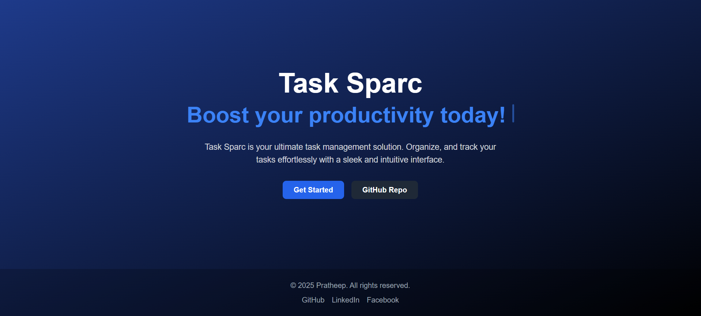

# 🚀 Task Manager App

A **modern, full-stack task management application** built with **Next.js 15, Supabase, and TailwindCSS**. This app allows users to create, update, and delete tasks while ensuring a smooth and responsive user experience.

 

## 🌟 Features

✅ **User Authentication** – Custom login & signup with JWT and bcrypt  
✅ **Task Management** – Add, edit, and delete tasks with due dates  
✅ **Real-Time Updates** – Supabase-powered data sync  
✅ **Responsive UI** – Built with TailwindCSS for mobile-friendly design  
✅ **Dark Mode** – A sleek and modern dark-themed interface  
✅ **Notifications** – Toast messages for user interactions  
✅ **Optimized Performance** – Utilizes Next.js 15 and Turbopack for speed  

## 🛠️ Tech Stack

### **Frontend**
- **Next.js 15 (React 19)**
- **TailwindCSS**
- **Framer Motion** (Animations)

### **Backend**
- **Next.js API Routes**
- **Supabase (PostgreSQL)**
- **Custom Authentication** (JWT & bcrypt.js)

### **Other Tools**
- **React Hooks** (State Management)
- **React Toastify** (Notifications)
- **ESLint & TypeScript** (Code Quality)

## 🚀 Getting Started

### **1️⃣ Clone the Repository**
```sh
git clone https://github.com/Pratheep-Srikones/task-app.git
cd task-app/app
```

### **2️⃣ Install Dependencies**
```sh
npm install
```

### **3️⃣ Set Up Environment Variables**
Create a `.env.local` file in the root directory and add your **Supabase credentials**:

```
NEXT_PUBLIC_SUPABASE_URL=your-supabase-url
NEXT_PUBLIC_SUPABASE_ANON_KEY=your-anon-key
NEXT_PUBLIC_JWT_SECRET = your-jwt-secret
```

### **4️⃣ Run the Development Server**
```sh
npm run dev
```

Now open **[http://localhost:3000](http://localhost:3000)** in your browser.


## 🤝 Contributing

Contributions are welcome! Feel free to fork this repository, open issues, or submit pull requests.

## 📜 License

This project is licensed under the **MIT License**.

---

💡 **Follow me on [LinkedIn](https://www.linkedin.com/in/pratheep-srikones-816110240/) for updates!**
